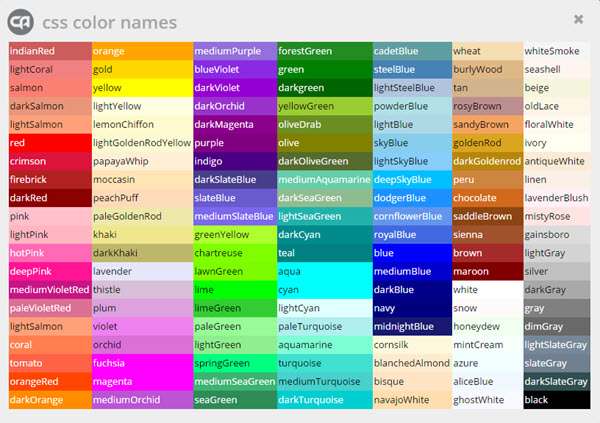

#CSS

[TOC]

We can give multiple elements the same rules by delitering them with a comma.

##Relative units

- **px** - number of pixels, dependent on screeen resolution.
- **em and ex** - size relative to current font size
- **%** - is a percentage of the page.
- **larger/smaller** - scale up and down from the current font size, usually by a factor of 1.2

##Representing colour

- hex - a hexedecimal number.
- hex short - #0000FF &rarr; #00F
- rgb &rarr; rgb(255,255,255)

There is also a set of predefined colours:
<div align="center">

</div>

##Levels of CSS

- external - styling a .css file
- document - placing a style tag
- inline - styling individual elements.

****Note that class selectors are more robust than id selectors.****

###Specificity

However above this there are rules within CSS files that govern how the end result will look:

- If two or more blocks have the same specificity the **last** will take effect (that is the cascading part).

| Column | Type |
|-|-|
| A | inline styles |
| B | IDs|
| C | classes, attributes and pseudo-clases |
| D | elements /pseudo-elements |
###Styling Classes

#### **Regular classes**
#### **IDs**
Are regarded as classes in some literature.
####**Pseudo Classes**
let you specify the state of an object (eg :hover)

- matching
- link
- dynamic
- language.

####Pseudo-Elements

These are elements based the state of other elements, and are denoted with a "::". Some examples include:

- before
- after
- first-letter
- first-child
- last child

##The Box Model

<div align="center">

</div>

This is the design layout of HTML elements. Each element is wrapped in a box that looks like the box above.

_But not all elements have these properties, which leads to differences between browsers_

##Animation

You can give an element the two attributes:

```CSS
animation-name: example;
animation-duration: 5s;
```

And then later on you can define

```CSS
@keyframes example
{
	from
    {
    	/* set of CSS properties. */
	}
    to
    {
    	/* target set of CSS properties */
    }
}
```

Alternatively you can define an **arbitrary number** of keyframes by using percentages:

```CSS
@keyframes example
{
	0%  { font-size:5px;}
    25% { font-size:10px;}
    50% { font-size:15px;}
    75% { font-size:20px;}
    100% { font-size:25px;}
}
```
